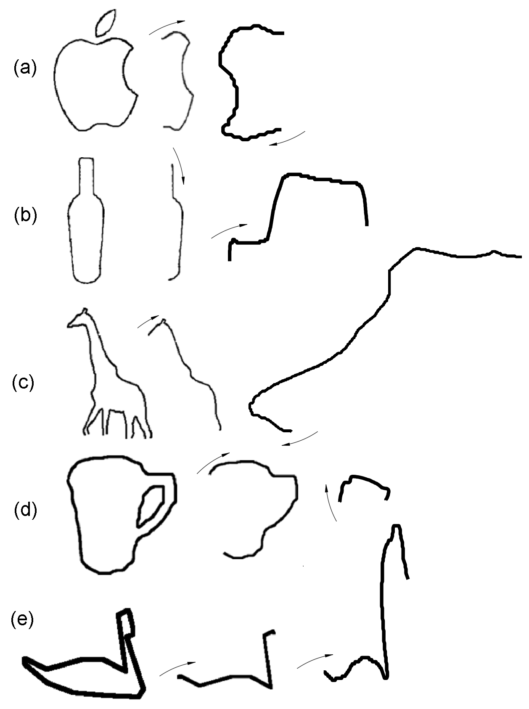

# Demo
## Abstract
The dissimilarity between simple curves is a major problem in computer vision systems that must distinguish and cluster different simple curves. In this contribution a quantitative approach for measuring dissimilarity between simple curves is proposed. Any contour can be represented by the slope chain code, which is invariant under translation, rotation, and scale. The proposed method normalizes both simple curves with same number of segments, then generates sub-chains with bounded accumulate slope, calculates the energy between each corresponding pair, and takes the normalized sum, retrieving a dissimilarity value from 0 to 1. The algorithm was validated with the ETHZ CS ETHZ database, which include 270 simple curves.

    

